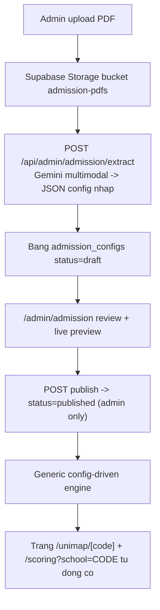

# Auto-generate trang tính điểm từ PDF đề án tuyển sinh

## 1. Đánh giá file `demo-manual.pdf`

PDF mô tả **quy ước tổ chức code** để scale admission engine lên 20+ trường: tách `shared/` (mỏng) → `schools/<school>/` → `engines/<engine>/` → UI chỉ điều phối; contract chung `schoolCode/engineId/year/payload/benchmark`; registry mỏng; checklist thêm trường/engine.

Kết luận đánh giá:
- PDF **đúng về nguyên tắc tách lớp** nhưng **giải bài toán khác** với yêu cầu của bạn. PDF giả định *dev viết tay một module code mỗi trường*. Yêu cầu của bạn là *upload PDF → tự sinh trang*, nên không thể vừa upload PDF vừa auto-sinh code TS chạy production an toàn.
- Vì vậy phương án tối ưu = **giữ tinh thần tách lớp của PDF, nhưng đổi "mỗi trường = một module code" thành "mỗi trường = một bản CONFIG dữ liệu"** do một engine tổng (generic) diễn giải. Code chỉ chứa các "formula primitive" dùng chung; trường mới chỉ là data.

## 2. Phương án tối ưu được khuyến nghị

Hybrid: **Config-driven + AI trích xuất ra bản nháp + admin review + publish bằng cờ DB.**

- **Automation:** AI parse PDF → sinh CONFIG nháp → admin sửa trong form quản trị → duyệt. (KHÔNG full-auto vì dữ liệu xét tuyển quá rủi ro về độ chính xác; KHÔNG codegen vì chậm/nguy hiểm.)
- **Deploy/duyệt:** dùng **cờ trạng thái DB** (`draft → pending_review → published`), trang hiện ngay sau khi duyệt, KHÔNG cần build/redeploy. Chỉ khi gặp công thức hoàn toàn mới (chưa có primitive) mới cần dev thêm 1 primitive qua Git PR (việc hiếm, làm 1 lần dùng cho mọi trường).

Lý do chọn cờ DB thay vì Git PR cho phần cấu hình: khớp pattern sẵn có (`advisor_weight_contributions.status`, `news_articles.published`), rollback = toggle, không downtime.

## 3. Kiến trúc đề xuất (config-driven, tăng dần)

Nguyên tắc tách lớp (ánh xạ từ PDF):
- **shared/** = engine tổng + các formula primitive (`weighted-combination`, `tsa-scale`, `sat-scale`, `cert-conversion`, `priority-bonus`) + validate theo schema.
- **schools/** = chỉ là **dòng config trong DB** (không còn folder code mỗi trường cho trường mới).
- Trường cũ (HUST/FTU/UET) **giữ nguyên module code hiện tại** để không vỡ tính năng đang chạy; chỉ trường mới thêm-qua-PDF đi đường config-driven. Migrate dần sau.

## 4. Thay đổi cụ thể trên codebase

- **Bỏ giới hạn `SchoolCode` cứng:** trong [src/lib/admission-engine/core/types.ts](src/lib/admission-engine/core/types.ts) cho phép `schoolCode: string`; [registry.ts](src/lib/admission-engine/core/registry.ts) thêm **fallback generic module** khi không tìm thấy module code → load config published từ DB và diễn giải.
- **Engine tổng mới:** `src/lib/admission-engine/generic/` gồm `config-schema.ts` (Zod/TS type cho config), `interpreter.ts` (chạy primitive theo config), `primitives/*`. `calculate()` trong [core/engine.ts](src/lib/admission-engine/core/engine.ts) gọi generic khi schoolCode không có module tĩnh.
- **API tính điểm:** [app/api/admission/calculate/route.ts](app/api/admission/calculate/route.ts) bỏ whitelist `SCHOOL_CODES`/`ADMISSION_METHODS` cứng, validate theo config published của trường.
- **DB migration mới** (`npx supabase db diff`): bảng `admission_configs` (school_code, year, config jsonb, status, source_pdf_url, created_by, reviewed_by, version) + bucket Storage `admission-pdfs`. Theo pattern status của `advisor_weight_contributions`.
- **API admin mới (admin-only, theo mẫu [app/api/advisor/apply-changes/route.ts](app/api/advisor/apply-changes/route.ts) dùng `isAdminRole`):**
  - `POST /api/admin/admission/extract` — nhận PDF, gọi Gemini (`@google/genai` đã có sẵn) với structured output → trả config nháp.
  - `GET/POST /api/admin/admission/configs` — list/lưu/cập nhật draft.
  - `POST /api/admin/admission/publish` — đổi status sang published.
- **Trang quản trị mới `/admin/admission`:** upload PDF, xem PDF cạnh form config sửa được, **live preview** calculator bằng config nháp, nút Duyệt & Publish. Tận dụng component admin đang mồ côi `components/zpath/AdvisorApplyChangesClient.tsx` làm tham chiếu pattern.
- **UI calculator:** refactor nhẹ [src/components/admission/AdmissionCalculatorSection.tsx](src/components/admission/AdmissionCalculatorSection.tsx) thêm nhánh **GenericConfigCalculator** (render form theo schema từ config) cho trường config-driven; giữ nhánh HUST/FTU/UET cũ.
- **Hiển thị trường mới:** [lib/unimap-visible-schools.ts](lib/unimap-visible-schools.ts) đọc thêm danh sách trường có config `published` để `/unimap/[code]` và `/scoring` tự xuất hiện.

## 5. Lưu ý quan trọng (rủi ro)

- **PDF đề án thường là ảnh scan** — chính `demo-manual.pdf` cũng là ảnh. Nên dùng **Gemini multimodal đọc thẳng ảnh/PDF** (đã có `@google/genai`), không phụ thuộc text-extract thuần. Cần render PDF→ảnh hoặc gửi PDF inline.
- **Không bao giờ auto-publish.** AI chỉ tạo nháp; bắt buộc admin xác nhận từng công thức/qui đổi.
- Bắt buộc có **test cho generic interpreter** (theo checklist engine của PDF: input hợp lệ/thiếu field/sai kiểu/output chuẩn/regression).

## 6. Phạm vi & quyết định cần bạn chốt khi triển khai

- Đồng ý hướng **config-driven cho trường mới, giữ code cũ cho HUST/FTU/UET**? (khuyến nghị: có)
- Đồng ý **publish bằng cờ DB** thay vì Git PR cho phần config? (khuyến nghị: có)
- Có cần versioning theo năm (`year`) ngay từ đầu không? (khuyến nghị: có, vì đề án đổi theo năm)